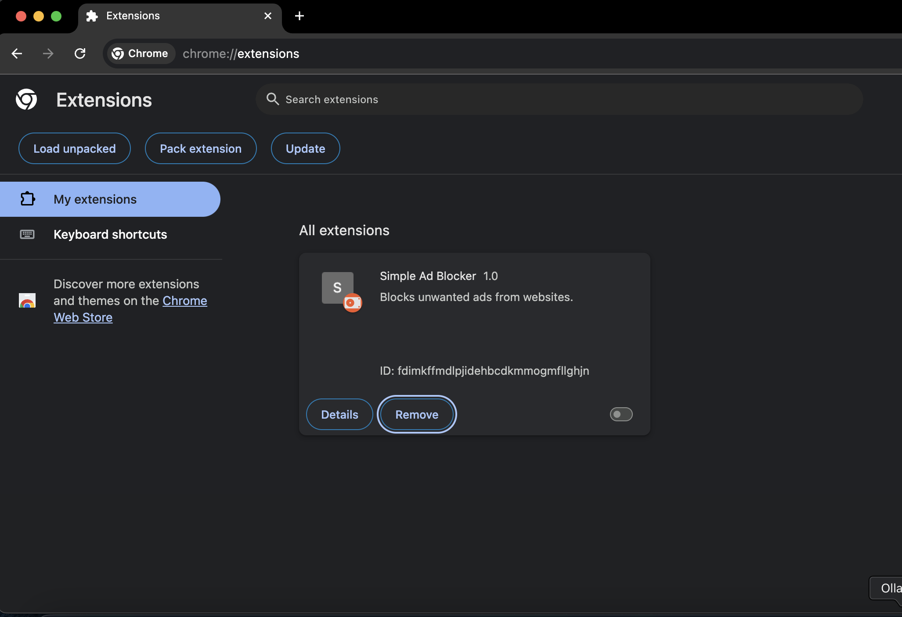
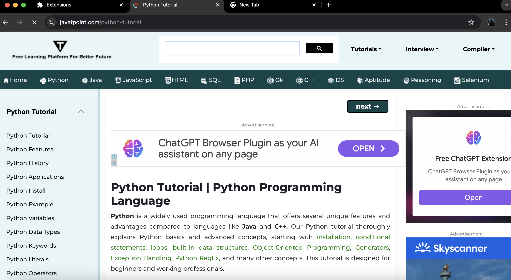
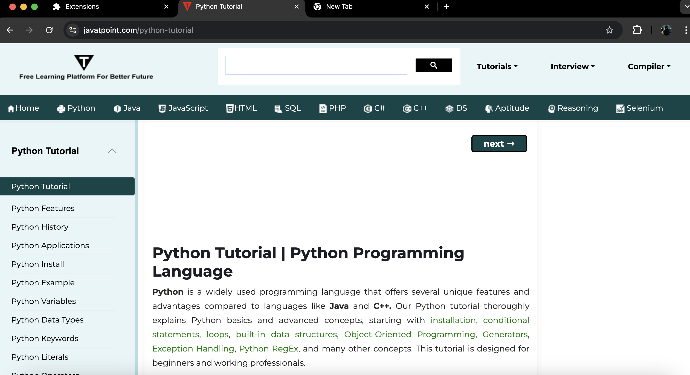

Here’s a high-level breakdown of how an ad blocker Chrome extension works in terms of its general workflow, focusing on ad-blocking functionality, user interaction, and rule management.
# Chrome Ad Blocker Extension

This Chrome extension blocks intrusive ads and enhances the browsing experience by preventing distracting ads from loading. It provides a simple toggle to enable or disable ad-blocking directly from the extension's popup.

## Overview

 <!-- Add a logo or relevant image here -->

---

### How It Works

The extension uses predefined rules to block ad-related requests on web pages. The user interface provides an "On/Off" toggle to easily enable or disable ad-blocking.

**Before Blocking Ads**



**After Blocking Ads**



### Installation

1. Clone the repository:
   ```bash
   git clone https://github.com/username/ad-blocker-extension.git
   ```
2. Open Chrome and go to `chrome://extensions`.
3. Enable **Developer Mode**.
4. Click **Load unpacked** and select the cloned folder.

### Features

- Blocks various types of ads (banners, pop-ups, video ads).
- Improves page load times and browsing experience.
- Simple toggle button for ad-blocking control.

### 1. **Initializing the Extension (manifest.json)**
   - **Purpose**: The `manifest.json` file acts as the configuration file that sets up permissions, background scripts, and user interface options.
   - **Key Actions**:
     - Specifies that the extension will use **declarativeNetRequest** permissions to block specific network requests (e.g., ad URLs).
     - Links to `background.js` as a service worker, so the extension can continue to listen for events even when the popup is closed.
     - Sets up `rules.json`, which contains the filtering rules for ad URLs.

### 2. **Defining Ad Blocking Rules (rules.json)**
   - **Purpose**: `rules.json` defines the rules for identifying ads. Each rule contains:
     - **URL Filters**: Keywords or domains typically associated with ads (e.g., “*ads*” or “*doubleclick.net*”).
     - **Resource Types**: Specifies what types of requests to block (e.g., script, image, XMLHttpRequest) since ads usually load through scripts and images.
   - **Execution**: Chrome uses these rules at runtime to block network requests that match the criteria defined in `rules.json`.

### 3. **Loading and Storing Ad-Blocking Status (background.js)**
   - **Purpose**: The `background.js` service worker runs in the background and is responsible for:
     - Checking the ad-blocking status (enabled or disabled) and updating it when the user toggles the state.
     - Communicating with the storage (`chrome.storage.local`) to save and retrieve the ad-blocking status.
   - **Key Actions**:
     - On installation, `background.js` sets the initial status of the ad blocker to "enabled."
     - Listens for messages from the popup (triggered by user interactions) to toggle the ad-blocking rules.
     - Based on the ad-blocking status, `background.js` either enables or disables the ad-blocking rules by updating `declarativeNetRequest`.

### 4. **Creating the User Interface (popup.html & popup.js)**
   - **Purpose**: The popup interface provides users with a visual toggle to enable or disable ad-blocking.
   - **Elements**:
     - A **status display** that shows if ad-blocking is "On" or "Off."
     - A **toggle button** to switch the ad-blocking state.
   - **Execution**:
     - When the popup opens, `popup.js` reads the `isBlocking` status from `chrome.storage.local` to update the display.
     - If the user clicks the button, `popup.js` sends a message to `background.js` to toggle the blocking status.
     - The background service updates the rules (enabled or disabled) and sends back the new status, updating the popup UI.

### 5. **Blocking Ads in Real-Time**
   - **How It Works**:
     - Whenever the user loads a webpage, Chrome automatically checks network requests against the extension’s `rules.json` filters.
     - If a network request matches any rule (e.g., contains `*ads*` or `*doubleclick.net*`), it is blocked.
   - **Result**: Ads are not loaded on the page, and users only see ad-free content.

### **General Workflow Recap**
   - **Step 1**: Extension initializes and loads `rules.json` (rules to block ads).
   - **Step 2**: `background.js` monitors ad-blocking status and toggles blocking rules when necessary.
   - **Step 3**: The popup UI enables users to view and change the ad-blocking status.
   - **Step 4**: Chrome blocks ad-related network requests in real-time, applying the rules from `rules.json`.

With this setup, the ad blocker operates by filtering network requests according to specified rules, giving the user control to toggle the blocking as needed via the popup UI.
